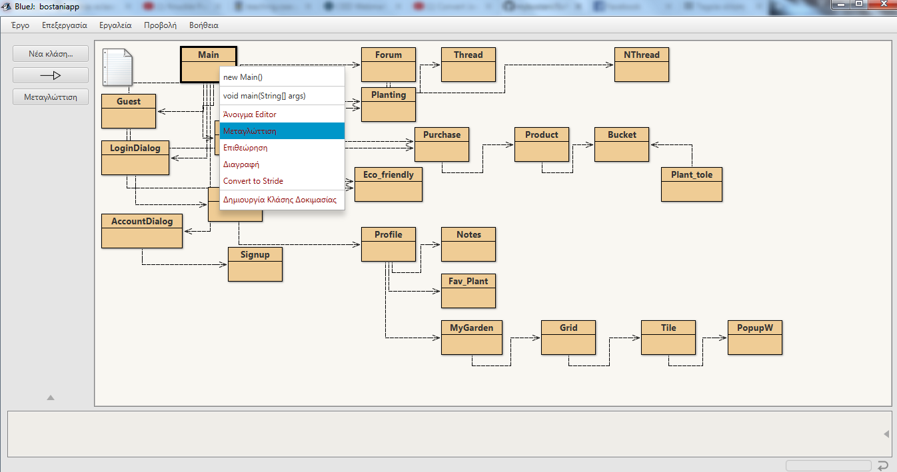
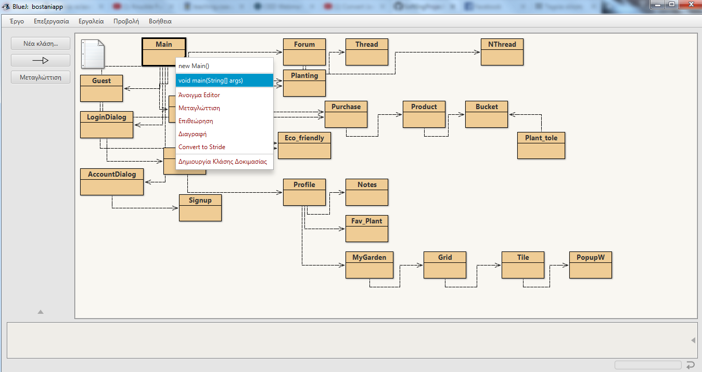

# Software Engineering Project for Ceid

Το έργο αφορά μια εφαρμογή στην ελληνική γλώσσα για desktop, η οποία θα  εντάσσεται στη θεματική της αστικής κηπουρικής.

## Οδηγίες και πληροφορίες
Οι οδηγίες αυτές είναι για να γίνει πιο κατανοητά τα βήματα ώστε να εκτελεστεί το app σε κάθε desktop.

### Prerequisites

Ένα οποιοδήποτε IDE που να αναγνωρίζει JAVA. Προτείνουμε το Bluej στο οποίο αναπτύχθηκε το application.

### Executable
Για ευκολία έχουμε δημιουργήσει ένα exe το οποίο κατεβάζετε στο desktop σας χωρίς κάποια περαιτέρω εγκατάσταση.

### Downloading and compiling

Κατεβάζετε το project στο pc. Ανοίγετε το package του bluej που περιέχεται στο file κάνετε compile την main κλάση ώστε να δημιουργηθούν τα executable αρχεία για να τρέξει το application.

## Running the app

Για να τρέξουμε το app επιλέγουμε δεξί κλίκ στη Main και επιλέγουμε void main(String[] args)

Κωδικοί για μέλος(member) έχουμε θέσει:  **username=mybostani και password=mybostani**

## Built With

* [Bluej](https://www.bluej.org) - Το IDE στο οποίο αναπτύχθηκε το application.

## Versioning
Αυτή είναι η τελική προσπάθεια (v_1.0) του κώδικα.

## Authors του project

* **Δημήτριος Κουμαδωράκης**  
* **Αικατερίνη Μαρία Παντελεάκη**
* **[Σωτήριος Σουκαράς](https://github.com/sskrs/)** 
* **Χρήστος Χρήστου**

## License

This project is licensed under the MIT License - see the 
 file for details

## Acknowledgments
